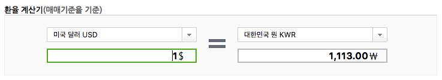

# exchange_table
> exchange table with AngularJS

## Usage

```
$ git clone git@github.com:jodeng110/exchange_table.git <my-new-project>
```

```
$ cd <my-new-project>
```

### Install

```
$ npm install -g gulp bower bower-installer
```

```
$ npm install
```

```
$ bower install
```

```
$ bower-installer
```

### Build
```
$ gulp build
```

### Run development mode

```
$ gulp develop
```

open Web Browser : http://localhost:3333/

### Result




#### 추가적으로 해보고 싶은 작업.
- 은행에서 환율 테이블 정보를 읽어들여와 저장한다. (실시간 or 특정 시간기준으로)
- 읽어들인 환율 정보를 기준으로 계산하도록 한다.